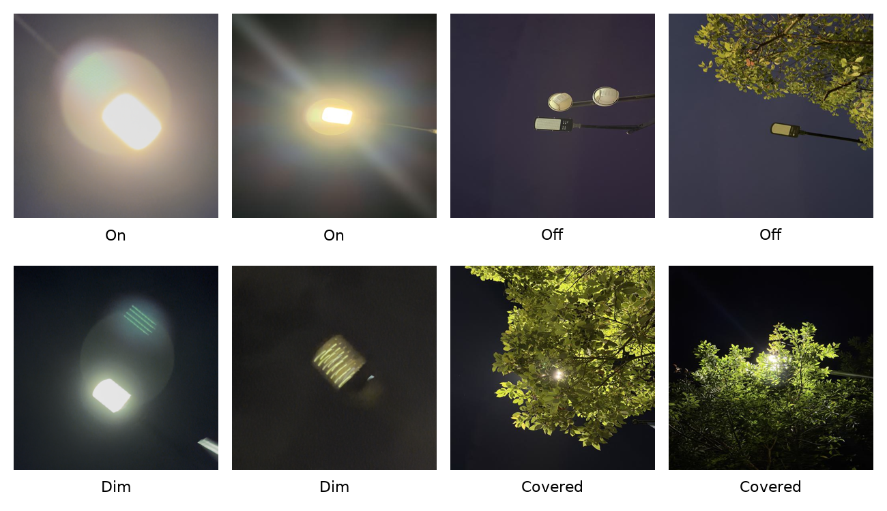
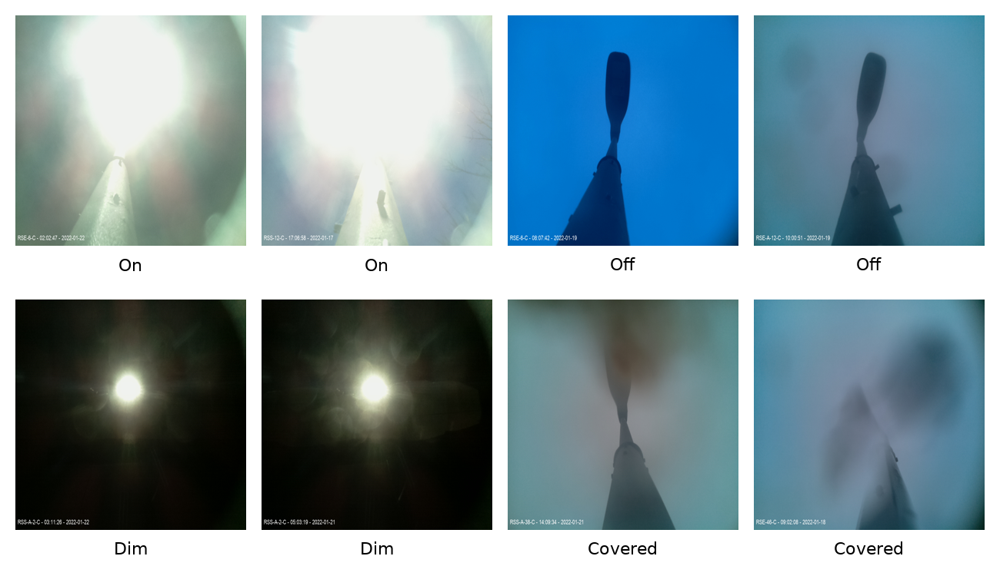
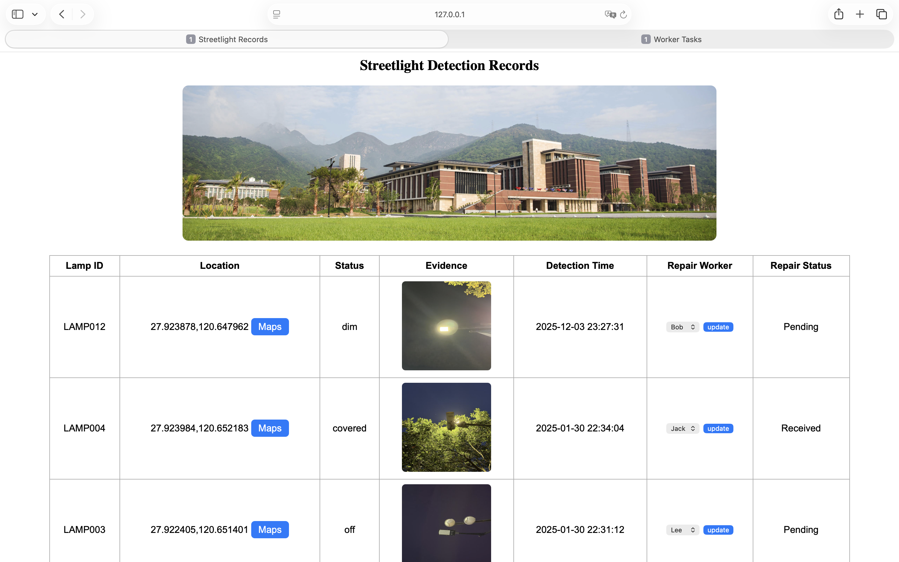

# Streetlight Fault Detection and Management System

This project develops a campus streetlight fault detection and management system based on computer vision and deep learning. It aims to improve the efficiency of traditional manual streetlight inspection by integrating image classification, automatic fault reporting, database storage, and web-based management into one practical workflow.

## Project Overview

Campus streetlights are important for night safety and daily management. However, traditional inspection usually depends on manual checking, which is time-consuming and inefficient. To address this problem, this project builds a complete system for streetlight fault detection and maintenance reporting.

The system includes three main parts:

1. **Image Collection**  
   Streetlight images are collected through manually simulated robot patrols along a fixed route on the Wenzhou-Kean University (WKU) campus.

2. **Image Classification**  
   Deep learning models are trained to classify streetlight images into four categories:
   - on
   - off
   - dim
   - covered

3. **Backend Reporting and Management**  
   Abnormal images are automatically renamed and stored, fault records are saved in a MySQL database, repair workers can be assigned, and maintenance progress can be managed through a web interface.

## Datasets

This project uses two datasets:

- **WKU dataset**  
  A self-collected dataset built from manually simulated robot patrol images on the WKU campus.

  

- **Public streetcare-dataset**  
  A cleaned and reorganized public streetlight dataset, adjusted into the same four classes:
  - on
  - off
  - dim
  - covered

  

The two datasets are trained and tested separately.

## Models

The following deep learning models are evaluated in this project:

- DenseNet121
- EfficientNetB0
- EfficientNetB1
- MnasNet1.0
- MobileNetV2
- MobileNetV3
- RegNetY400MF
- ResNet18
- ShuffleNetV2

## Results

### WKU dataset
DenseNet121 and ResNet18 achieved the best overall performance on the WKU dataset:

- Accuracy: 97.14%
- Macro Precision: 95.83%
- Macro Recall: 98.75%
- Macro F1-score: 97.09%

### Public streetcare-dataset
EfficientNetB1, MnasNet1.0, MobileNetV3, and RegNetY400MF achieved the best overall performance on the public dataset:

- Accuracy: 99.17%
- Macro Precision: 99.57%
- Macro Recall: 98.61%
- Macro F1-score: 99.07%

### Reporting system
The reporting system worked effectively in the project testing. After image classification, abnormal streetlight images classified as off, dim, or covered were automatically processed and recorded as fault reports. The system renamed abnormal images with related information and stored the records in the MySQL database. The backend web interface allowed administrators to view fault records, assign repair workers, and track repair progress, while workers could check assigned tasks and update repair status. These results show that the reporting system can successfully connect fault detection with maintenance management in one practical workflow.



## System Functions

The backend system supports:

- automatic abnormal image renaming
- MySQL database storage
- repair worker assignment
- repair status update
- web-based management interface

Repair status includes:

- Pending
- Received
- Processing
- Completed
- Fail

## Technology Stack

- **Python**
- **PyTorch**
- **Flask**
- **MySQL**
- **PyMySQL**
- **HTML / CSS**
- **Computer Vision / Deep Learning**

## Project Structure

```bash
project/
│── Figures/
│── Image Classification/
│── Reporting System/
│── README.md
